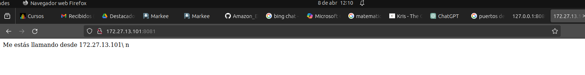
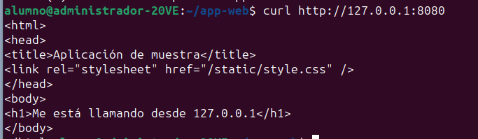
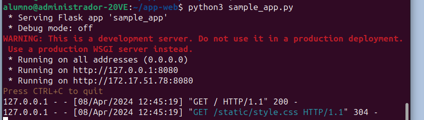
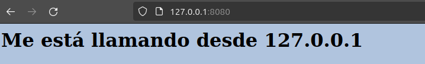
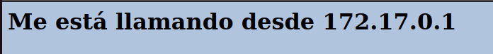
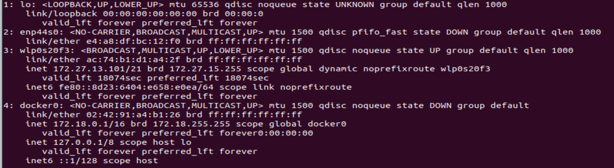
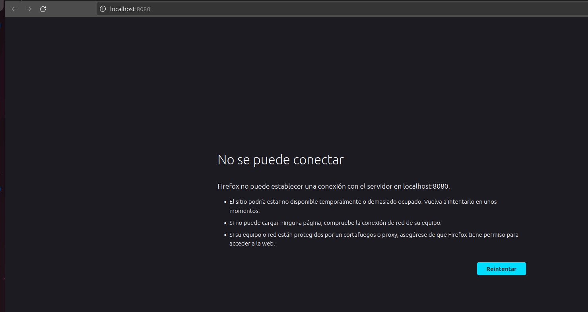

> .
>
> **Objetivos**
>
> **Parte 1: Crear un script Bash simple Parte 2: Crear una aplicación
> web simple**
>
> **Parte 3: Configurar la aplicación web para utilizar archivos de
> sitio web**
>
> **Parte 4: Crear un script de Bash para compilar y ejecutar un
> contenedor Docker Parte 5: Construir, ejecutar y verificar el
> contenedor Docker**
>
> **Aspectos básicos/Situación**
>
> En esta evaluación, revisará las técnicas básicas de scripting bash ya
> que este es un requisito previo para el resto del curso. A
> continuación, compilará y modificará una secuencia de comandos de
> Python para una aplicación web simple. Además, creará un script bash
> para automatizar el proceso de creación de un Dockerfile, creación del
> contenedor Docker y ejecución del contenedor Docker. Finalmente,
> utilizará los comandos de docker para investigar las complejidades de
> la instancia del contenedor Docker.
>
> **Entregable**: Debes entregar el resultado final de la actividad en
> tu repositorio de github.

# 1. Crear un Bash Script simple

> El conocimiento de Bash (tendrás de esto luego) es crucial para
> trabajar con integración continua, implementación continua,
> contenedores y con su entorno de desarrollo. Los scripts de Bash
> ayudan a los programadores a automatizar una variedad de tareas en un
> archivo de script. En esta parte, revisará brevemente cómo crear un
> script bash. Más adelante, usará un script bash para automatizar la
> creación de una aplicación web dentro de un contenedor Docker.

## Crear un archivo Bash vacío

> Cambie su directorio de trabajo a **\~/home/alumno/app-web** y agregue
> un nuevo archivo llamado

### user-input.sh.

> \~\$ **cd /home/alumno/app-web**
>
> \~/home/alumno/app-web \$ **touch user-input.sh**

## Abrir el archivo en el editor de texto nano.

> Utilice el comando **nano** para abrir el editor de texto nano.
>
> /home/alumno/app-web\$ **nano user-input.sh**

## Añada la \'she-bang\' a la parte superior del script.

> Desde aquí puede ingresar comandos para su script bash. Utilice las
> teclas de flecha para navegar en **nano**. Observe los comandos en la
> parte inferior (no se muestran aquí) para administrar el archivo. El
> símbolo de quilate (\^) indica que utiliza la tecla CTRL o Comando del
> teclado. Por ejemplo, para salir de **nano**, escriba CTRL+X.
>
> Agregue el \'she-bang\' que le dice al sistema que este archivo
> incluye comandos que deben ejecutarse en el shell bash.
>
> #!/bin/bash
>
> **Nota**: Puede usar un editor de texto gráfico o abrir el archivo con
> VS Code. Sin embargo, debe estar familiarizado con los editores de
> texto de línea de comandos como **nano** y **vim**. Busque tutoriales
> en Internet para actualizar sus habilidades o aprender más sobre
> ellos.

## Agregar comandos simples de bash al script.

> Introducir algunos comandos bash simples para su script. Los
> siguientes comandos solicitarán al usuario un nombre, establecerán el
> nombre en una variable llamada **username** y mostrarán una cadena de
> texto con el nombre del usuario.
>
> echo -n \"Introduzca su nombre: \" read userName
>
> echo \"Tu nombre es \$userName.\"

## Salga de nano y guarde su script.

> Presione **CTRL+X**, luego **Y**, luego **ENTRAR** para salir de
> **nano** y guardar el script.
>
> alumno@administrador-20VE:\~/app-web\$ ./user-input
>
> Introduzca su nombre: Vanesa
>
> Tu nombre es Vanesa.

## Ejecutar el script desde la línea de comandos.

> Puede ejecutarlo directamente desde la línea de comandos usando el
> siguiente comando.
>
> /home/alumno/app-web\$ **bash user-input.sh**
>
> Escribir su nombre: Kapumota Tu nombre es Bob.
>
> /home/alumno/app-web\$

## Cambiar el modo del script a un archivo ejecutable para todos los usuarios.

> Modifique el modo de la secuencia de comandos a un ejecutable mediante
> el comando **chmod**. Establezca las opciones en **a+x** para que el
> script sea ejecutable (x) para todos los usuarios (a). Después de usar
> **chmod**, se han modificado los permisos de aviso para usuarios,
> grupos y otros para incluir la \"x\" (ejecutable).
>
> /home/alumno/app-web\$ **ls -l user-input.sh**
>
> -rw-rw-r\-- 1 alumno alumno 90 abr 8 11:49 user-input.sh
>
> /home/alumno/app-web\$ **chmod a+x user-input.sh**
>
> /home/alumno/app-web\$ **ls -l user-input.sh**
>
> -rwxrwxr-x 1 alumno alumno 90 abr 8 11:49 user-input.sh

## Cambiar el nombre del archivo para eliminar la extensión .sh.

> Puede cambiar el nombre del archivo para quitar la extensión de modo
> que los usuarios no tengan que agregar .sh al comando para ejecutar la
> secuencia de comandos.
>
> /home/alumno/app-web\$ **mv user-input.sh user-input**

## Ejecutar el script desde la línea de comandos.

> Ahora el script se puede ejecutar desde la línea de comandos sin el
> comando **source** o una extensión. Para ejecutar un script bash sin
> el comando source, debe escribir \"./\" delante del nombre del script.
>
> /home/alumno/app-web\$ **./user-input**
>
> Introduzca su nombre: Vanesa
>
> Tu nombre es Vanesa.

## Investigar otros scripts bash.

> Si tienes poca o ninguna experiencia en la creación de scripts bash,
> tómate un tiempo para buscar tutoriales de bash, ejemplos de bash y
> juegos de bash en Internet.
>
> Por ejemplo, #!/bin/bash
>
> if ! ps aux \| grep -q \"\[n\]ombre_del_proceso\"; then echo \"El
> proceso no está corriendo. Reiniciando\...\"
> comando_para_reiniciar_el_proceso
>
> fi O
>
> #!/bin/bash
>
> ps -eo stat,pid,cmd \| grep \"\^Z\" \| while read stat pid cmd; do
> echo \"Proceso zombi detectado: PID=\$pid CMD=\$cmd\" done
>
> O
>
> #!/bin/bash while true; do
>
> ps -eo %cpu,pid,cmd \--sort=-%cpu \| head -n 10 \| awk \'\$1 \> 80.0 {
> printf(\"Alto uso de CPU (%s%%) por PID %s: %s\\n\", \$1, \$2, \$3);
>
> }\' \| while read LINE; do
>
> echo \"\$LINE\" \| mail -s \"Alerta de CPU\" <admin@domain.com> done
>
> sleep 60 done
>
> O
>
> #!/bin/bash PROCESS_NAME=\"httpd\"
>
> MAX_INSTANCES=10
>
> count=\$(ps -C \$PROCESS_NAME \--no-headers \| wc -l) if \[ \$count
> -gt \$MAX_INSTANCES \]; then
>
> echo \"Número máximo de instancias (\$MAX_INSTANCES) superado para
> \$PROCESS_NAME con
>
> \$count instancias.\" Fi
>
> bashuser1-input.s

alumno@administrador-20VE:\~/app-web\$ bash user1-input.sh

El proceso no está corriendo. Reiniciando\...

# Crear una aplicación web simple

> Antes de poder lanzar una aplicación en un contenedor Docker, primero
> necesitamos tener la aplicación. En esta parte, creará un script
> Python muy simple que mostrará la dirección IP del cliente cuando el
> cliente visite la página web.

## Instalar Flask y abrir un puerto

> Los desarrolladores de aplicaciones web que utilizan Python suelen
> aprovechar un marco de trabajo (framework). Un framework es una
> biblioteca de códigos para facilitar a los desarrolladores la creación
> de aplicaciones web fiables, escalables y mantenibles. Flask es un
> framework de aplicación web escrito en Python. Otros frameworks
> incluyen Tornado y Pyramid.
>
> Puede utilizar este frameworks para crear la aplicación web de
> muestra.
>
> Flask recibe solicitudes y luego proporciona una respuesta al usuario
> en la aplicación web. Esto es útil para aplicaciones web dinámicas
> porque permite la interacción del usuario y el contenido dinámico. Lo
> que hace que su aplicación web de muestra sea dinámica es que mostrará
> la dirección IP del cliente.
>
> **Nota**: La comprensión de las funciones, métodos y bibliotecas de
> Flask está fuera del alcance de este curso. Se utiliza para mostrar la
> rapidez con la que se puede poner en marcha una aplicación web. Si
> desea obtener más información, busque en Internet para obtener más
> información y tutoriales sobre el framework de Flask.
>
> Abrir una ventana de terminal e importe el **flask**.
>
> /home/alumno/app-web \$ **pip3 install flask**
>
> **Puedes usar:
> [[https://flask.palletsprojects.com/en/3.0.x/installation/]{.underline}](https://flask.palletsprojects.com/en/3.0.x/installation/)
> y la creación de un entorno de trabajo.**

## Abra el archivo sample_app.py.

> Abra el archivo **sample_app.py** ubicado en el directorio
> **/sample-app**. Puede hacer esto dentro de VS Code o puede usar un
> editor de texto de línea de comandos como **nano** o **vim**.

## Añadir los comandos para importar métodos desde flask.

> Agregar los siguientes comandos para importar los métodos necesarios
> desde la biblioteca flask.
>
> from flask import Flask from flask import request

## Crear una instancia de la clase Flask.

> Cree una instancia de la clase Flask y nombrela sample**.** Asegúrese
> de usar dos guiones bajos antes y después del \"nombre\".
>
> sample = Flask( name )

## Definir un método para mostrar la dirección IP del cliente.

> A continuación, configure Flask para que cuando un usuario visite la
> página predeterminada (directorio raíz), muestre un mensaje con la
> dirección IP del cliente.
>
> \@sample .route (\"/\") def main():
>
> return \"Me estás llamando desde \" + request.remote_addr + \"\\ n\"
>
> Observe la instrucción \@sample .route (\"/\") Flask. Los frameworks
> como Flask usan una técnica de enrutamiento (routing) (. route) para
> referirse a una URL de aplicación (esto no debe confundirse con el
> enrutamiento de red). Aquí el \"/\" (directorio raíz) está enlazado a
> la función main (). Por lo tanto, cuando el usuario va a
> [http://localhost:8080/]{.underline} (directorio raíz) URL, la salida
> de la declaración de retorno se mostrará en el navegador.

## Configurar la aplicación para que se ejecute localmente.

> Finalmente, configurar Flask para ejecutar la aplicación localmente en
> [http://0.0.0.0:8080]{.underline}, que también es
> [http://localhost:8080]{.underline}. Asegúrese de usar dos guiones
> bajos antes y después de \"name\", y antes y después de \"main\".
>
> if name == \" main \":
>
> sample.run (host=\"0.0.0.0\", port=8080)

## Guardar y ejecute su aplicación web de ejemplo.

> Guarde su script y ejecútelo desde la línea de comandos. Debería ver
> la siguiente salida que indica que su servidor de «\"smple-app\" se
> está ejecutando. Si no ve el siguiente resultado o si recibe un
> mensaje de error, compruebe cuidadosamente su script sample_app.py.
>
> /home/alumno/app-web \$ **python3 sample_app.py**

-   Serving Flask app \"sample app\" (lazy loading)

-   Environment: production

> ADVERTENCIA: Este es un servidor de desarrollo. No lo utilice en una
> implementación de producción.
>
> Utilice un servidor WSGI de producción en su lugar.
>
> \*Modo de depuración: apagado

-   Ejecutando en [http://0.0.0.0:8080/]{.underline} (Presione CTRL+C
    > para salir)

> {width="6.40660542432196in"
> height="0.8194444444444444in"}

## Comprobar que el servidor se está ejecutando.

> Puede verificar que el servidor se está ejecutando de dos maneras.

(1) Abra el navegador web Chromium e introduzca 0.0.0.0:8080 en el campo
    > URL. Debería obtener la siguiente salida:

### Me estás llamando desde 127.0.0.1

> Si recibe una respuesta de \"HTTP 400 Bad Request\", compruebe
> cuidadosamente su script sample_app.py.

(2) Abrir otra ventana de terminal y utilice la herramienta URL de línea
    > de comandos (cURL) para verificar la respuesta del servidor.

> /home/alumno/app-web \$ **curl [http://0.0.0.0:8080]{.underline}**
>
> Me estás llamando desde 127.0.0.1
>
> /home/alumno/app-web\$

{width="6.40660542432196in"
height="1.8611111111111112in"}

## Detener el servidor.

> Volver a la ventana de terminal donde se está ejecutando el servidor y
> presione CTRL+C para detener el servidor.

# Configurar la aplicación web para utilizar archivos de sitio web

> En esta parte, construya la aplicación web de ejemplo para incluir una
> página **index.html** y una especificación **style.css**. El
> **index.html** es normalmente la primera página cargada en el
> navegador web de un cliente al visitar su sitio web. El **style.css**
> es una hoja de estilo utilizada para personalizar el aspecto de la
> página web.

## Explorar los directorios que utilizará la aplicación web.

> **Las plantillas** de directorios y **static** ya están en el
> directorio de **sample-app**, Abra **index.html** y **style.css** para
> ver su contenido. Si está familiarizado con HTML y CSS, personalice
> estos directorios y archivos tanto como desee. Sin embargo, asegúrese
> de mantener el código Python incrustado
>
> **{{request.remote_addr}}** en el archivo **index.html**, ya que este
> es el aspecto dinámico de la aplicación web de muestra.
>
> Revisa: [[Folder structure for a Flask
> app]{.underline}](https://python-adv-web-apps.readthedocs.io/en/latest/flask3.html)
>
> /home/alumno/app-web\$ **cat templates/index.html**
>
> \<html\>
>
> \<head\>
>
> \<title\>Aplicación de muestra\</title\>
>
> \<link rel=\"stylesheet\" href=\"/static/style.css\" /\>
>
> \</head\>
>
> \<body\>
>
> \<h1\>Me está llamando desde [{ {request.remote_addr}}]{.mark}\</h1\>
>
> \</body\>
>
> \</html\>
>
> /home/alumno/app-web\$ **cat static/style.css**
>
> body {background: lightsteelblue;}
>
> /home/alumno/app-web\$

## Actualizar el código Python para la aplicación web de muestra.

> Ahora que ha explorado los archivos básicos del sitio web, debe
> actualizar el archivo **sample_app.py** para que renderice el archivo
> **index.html** en lugar de solo devolver datos. Generar contenido HTML
> usando código Python puede ser tedioso, especialmente cuando se usan
> sentencias condicionales o estructuras repetidas. El archivo HTML se
> puede renderizar automáticamente en Flask utilizando la función
> render_template. Esto requiere importar el método **render_template**
> de la biblioteca de Flask y editar a la función de **return**. Realice
> las ediciones resaltadas en el script.
>
> from flask import Flask from flask import request
>
> [from flask import render_template]{.mark} sample = Flask ( name )
>
> \@sample .route (\"/\") def main():
>
> return [render_template («index.html»)]{.mark}
>
> if name == \" main \":
>
> sample.run (host=\"0.0.0.0\", port=8080)

## Guardar y ejecutar el script.

> Guarde y ejecute el script **sample-app.py**. Debería obtener una
> salida como la siguiente:
>
> /home/alumno/app-web\$ **python3 sample_app.py**

-   Serving Flask app \"sample app\" (carga perezosa)

-   Environment: production

> ADVERTENCIA: Este es un servidor de desarrollo. No lo utilice en una
> implementación de producción.
>
> Utilice un servidor WSGI de producción en su lugar.
>
> \*Modo de depuración: apagado

-   Ejecutando en [http://0.0.0.0:8080/]{.underline} (Presione CTRL+C
    > para salir)

-   

> **Nota**: Si obtuvo la salida de rastreo (Traceback)
> y{width="6.40660542432196in"
> height="1.8194444444444444in"} un error con un mensaje similar a
> **OSError: \[Errno 98\] Address already in use**, entonces no apagó el
> servidor anterior. Vuelva a la ventana de terminal donde se está
> ejecutando el servidor y presione CTRL+C para finalizar el proceso del
> servidor.
>
> Vuelva a ejecutar el script.

## Comprobar que el programa se está ejecutando.

> De nuevo, puede verificar que su programa se está ejecutando de dos
> maneras.

(1) Abrir el navegador web Chromium e introduzca 0.0.0.0:8080 en el
    > campo URL. Debería obtener la misma salida que antes. Sin embargo,
    > su fondo será azul metálico claro y el texto tendrá el formato H1.

### Me estás llamando desde 127.0.0.1

(2) Abrir otra ventana de terminal y utilice el comando **curl** para
    > verificar la respuesta del servidor. Aquí es donde verá el
    > resultado del código HTML renderizado automáticamente usando la
    > función render_template. En este caso, obtendrá todo el contenido
    > HTML. Sin embargo, el código dinámico de Python se reemplazará por
    > el valor de

> **{{request.remote_addr}}**. Además, observe que su mensaje estará en
> la misma línea que la última línea de salida HMTL. Presionar ENTER
> para obtener una nueva línea.
>
> /home/alumno/app-web\$ **curl [http://0.0.0.0:8080]{.underline}**
>
> \<html\>
>
> \<head\>
>
> \<title\>Aplicación de muestra\</title\>
>
> \<link rel=\"stylesheet\" href=\"/static/style.css\" /\>
>
> \</head\>
>
> \<body\>
>
> \<h1\>Me estás llamando desde [127.0.0.1]{.mark}\</h1\>
>
> \</body\>
>
> \</html\>/home/alumno/app-web\$
>
> /home/alumno/app-web\${width="6.40660542432196in"
> height="0.9583333333333334in"}

## Detener el servidor.

> Volver a la ventana de terminal donde se está ejecutando el servidor y
> presione CTRL+C para detener el servidor.

# Crear un script de Bash para compilar y ejecutar un contenedor Docker

> Una aplicación se puede implementar en un servidor bare metal
> (servidor físico dedicado a un entorno de inquilino único) o en una
> máquina virtual. También se puede implementar en una solución
> contenerizada como Docker. En esta parte, creará un script bash y le
> agregará comandos que completen las siguientes tareas para crear y
> ejecutar un contenedor Docker:

1.  Crear directorios temporales para almacenar los archivos del sitio
    > web.

2.  Copiar los directorios del sitio web y sample_app.py en el
    > directorio temporal.

3.  Crear un archivo docker (Dockerfile).

4.  Construir el contenedor Docker.

5.  Iniciar el contenedor y comprobar que se está ejecutando.

## Crear directorios temporales para almacenar los archivos del sitio web.

> Abrir el archivo de script **sample-app.sh** bash en el directorio
> donde has estado trabajando en la actividad. Agregar el \'she-bang\' y
> los comandos para crear una estructura de directorios con **tempdir**
> como directorio principal.
>
> #!/bin/bash
>
> mkdir tempdir
>
> mkdir tempdir/templates mkdir tempdir/static

## Copiar los directorios del sitio web y sample_app.py en el directorio temporal.

> En el archivo **sample-app.sh**, agregue los comandos para copiar el
> directorio del sitio web y el script a **tempdir**.
>
> cp sample_app.py tempdir/.
>
> cp -r templates /\* tempdir/templates/. cp -r static/\*
> tempdir/static/.

## Crear un archivo docker (Dockerfile).

> En este paso, introduzca los comandos bash **echo** necesarios en el
> archivo **sample-app.sh** para crear un archivo Dockerfile en el
> **tempdir**. Este archivo Dockerfile se utilizará para construir el
> contenedor.

(a) Necesita que Python se ejecute en el contenedor, así que agregue el
    > comando Docker

> **FROM** para instalar Python en el contenedor.
>
> echo \"FROM python\" \>\> tempdir/DockerFile

(b) Su script **sample_app.py** necesita Flask, por lo que agregue el
    > comando Docker **RUN** para instalar Flask en el contenedor.

> echo \"RUN pip install flask\" \>\> tempdir/DockerFile

(c) El contenedor necesitará las carpetas del sitio web y el script
    > **sample_app.py** para ejecutar la aplicación, así que agregue los
    > comandos de Docker **COPY** para agregarlos a un directorio en el
    > contenedor Docker. En este ejemplo, creará **/home/myapp** como el
    > directorio principal dentro del contenedor Docker. Además de
    > copiar el archivo sample_app.py al archivo Dockerfile, también
    > copiará el archivo index.html del directorio de plantillas y el
    > archivo style.css del directorio static.

> echo \"COPY./static /home/miapp/static/ \"\>\> tempDir/DockerFile
>
> echo \"COPY./templates /home/miapp/templates/ \"\>\>
> tempdir/DockerFile echo \"COPY sample_app.py /home/myapp/\" \>\>
> tempdir/DockerFile

(d) Utiliza el comando Docker **EXPOSE** para exponer el puerto 8080
    > para su uso por el servidor web.

> echo \"EXPOSE 8080\" \>\> tempdir/DockerFile

(e) Finalmente, agregue el comando Docker **CMD** para ejecutar el
    > script de Python.

> echo \"CMD python3 /home/myapp/sample_app.py\" \>\> tempdir/DockerFile

## Construir el contenedor Docker.

> Agregue los comandos al archivo **sample-app.sh** para cambiar al
> directorio **tempdir** y cree el contenedor Docker. La opción **-t**
> del comando de **docker build** le permite especificar el nombre del
> contenedor y el período final (**.**) indica que desea que el
> contenedor se construya en el directorio actual.
>
> cd tempdir
>
> docker build -t sampleapp.

## Iniciar el contenedor y comprobar que se está ejecutando.

(a) Agregue el comando **docker run** al archivo **sample-app.sh** para
    > iniciar el contenedor.

> docker run -t -d -p 8080:8080 \--name samplerunning sampleapp
>
> Las opciones de **docker run** indican lo siguiente:

-   **-t** especifica que desea crear un terminal para el contenedor
    > para que pueda acceder a él en la línea de comandos.

-   **-d** indica que desea que el contenedor se ejecute en segundo
    > plano e imprima el ID del contenedor al ejecutar el comando
    > **docker ps -a.**

-   **-p** especifica que desea publicar el puerto interno del
    > contenedor en el host. El primer «8080\" hace referencia al puerto
    > para la aplicación que se ejecuta en el contenedor Docker (nuestra
    > sampleapp). el segundo «8080\" le dice a Docker que use este
    > puerto en el host. Estos valores no tienen que ser los mismos. Por
    > ejemplo, un puerto interno 80 a 800 externo (**80:800**).

-   **---name** especifica primero lo que desea llamar a la instancia
    > del contenedor (**samplerunning**) y luego la imagen del
    > contenedor en la que se basará la instancia (**sampleapp**). El
    > nombre de la instancia puede ser cualquier cosa que desee. Sin
    > embargo, el nombre de la imagen debe coincidir con el nombre del
    > contenedor que especificó en el comando de compilación de docker
    > (**sampleapp**).

(b) Agregue el comando **docker ps -a** para mostrar todos los
    > contenedores Docker que se están ejecutando actualmente. Este
    > comando será el último ejecutado por el script bash.

> docker ps -a
>
> **Guardar el script bash.**

# Crear, ejecutar y verificar el contenedor Docker

> En esta parte, ejecutará el script bash que hará los directorios,
> copiará los archivos, creará un Dockerfile, construirá el contenedor
> Docker, ejecutará una instancia del contenedor Docker y mostrará la
> salida del comando d**ocker ps -a** que muestra los detalles del
> contenedor que se está ejecutando actualmente. Luego investigará el
> contenedor Docker, evitará que el contenedor se ejecute y eliminará el
> contenedor.
>
> **Nota**: Asegúrese de que ha detenido cualquier otro proceso de
> servidor web que todavía tenga ejecutándose desde las partes
> anteriores de esta evaluación.

## Ejecutar el script bash.

> Ejecutar el script bash desde la línea de comandos. Debería verse un
> resultado similar a lo siguiente. Después de crear los directorios
> **tempdir**, el script ejecuta los comandos para crear el contenedor
> Docker. Observe que el paso 7/7 de la salida ejecuta **sample_app.py**
> que crea el servidor web.
>
> Además, observe el ID del contenedor. Verá esto en el símbolo del
> sistema de Docker más adelante en el laboratorio.
>
> /home/alumno/app-web\$ **bash.** /sample-app.sh Sending build context
> to docker daemon 6.144kB Step 1/7: FROM python
>
> latest: Pulling from library/python 90fe46dd8199: Pulling fs layer
> 35a4f1977689: Pulling fs layer bbc37f14aded: Pull complete
> 74e27dc593d4: Pull complete 4352dcff7819: Pull complete deb569b08de6:
> Pull complete 98fd06fa8c53: Pull complete 7b9cc4fdefe6: Pull complete
> 512732f32795: Pull complete
>
> Digest:
> sha256:ad7fb5bb4770e08bf10a895ef64a300b288696a1557a6d02c8b6fba984b86a
> Status: Downloaded newer image for python:latest
>
> \-\--\> 4f7cd4269fa9
>
> Step 2/7: RUN pip install flask
>
> ---\> Running in 32d28026afea Collecting flask
>
> Downloading Flask-1.1.2-py2.py3-none-any.whl (94 kB) Collecting
> click\>=5.1
>
> Downloading click-7.1.2-py2.py3-none-any.whl (82 kB) Collecting
> Jinja2\>=2.10.1
>
> Downloading Jinja2-2.11.2-py2.py3-none-any.whl (125 kB) Collecting
> Werkzeug\>=0,15
>
> Downloading Werkzeug-1.0.1-py2.py3-none-any.whl (298 kB) Collecting
> itsdangerous\>=0.24
>
> Downloading itsdangerous-1.1.0-py2.py3-none-any.whl (16 kB) Collecting
> MarkupSafe\>=0.23
>
> Downloading Markupsafe-1.1.1-CP38-CP38-ManyLinux1_x86_64.whl (32 kB)
>
> Instaling collected packages: click, MarkupSafe, Jinja2, Werkzeug,
> itsdangerous, flask
>
> Succesfully instaled Jinja2-2.11.2 Markupsafe-1.1.1 Werkzeug-1.0.1
> click-7.1.2 flask-1.1.2 itsdangerous-1.1.0
>
> Removing intermediate container 32d28026afea
>
> \-\--\> 619aee23fd2a
>
> Step 3/7: COPY./static /home/myapp/static/
>
> \-\--\> 15fac1237eec
>
> Step 4/7: COPY ./templates /home/miapp/templates/
>
> \-\--\> dc807b5cf615
>
> Step 5/7: COPY sample_app.py /home/myapp/
>
> \-\--\> d4035a63ae14 Step 6/7: EXPOSE 8080
>
> ---\> Running in 40c2d35aa29a
>
> Removing intermediate container 40c2d35aa29a
>
> \-\--\> eb789099a678
>
> Step 7/7: [CMD python3 /home/myapp/sample_app.py]{.mark}
>
> ---\> Running in 41982e2c6209
>
> Removing intermediate container 41982e2c6209
>
> \-\--\> a2588e9b0593
>
> Succesfully built a2588e9b0593 Succesfully tagged sampleapp:latest
>
> 8953a95374ff8ebc203059897774465312acc8f0ed6abd98c4c2b04448a56ba5
> CONTAINER ID IMAGE CREATED STATUS PORTS NAMES
>
> [8953a95374ff]{.mark} sampleapp «/bin/sh -c \'python\... \"1 secong
> ago up less than a second
>
> 0.0.0. 0:8080 -\>8080/tcp samplerunning
>
> /home/alumno/app-web\$

## Investiga el contenedor Docker en ejecución y la aplicación web.

(a) La creación de los directorios **tempdir** no se muestran en la
    > salida del script. Puede agregar comandos **echo** para imprimir
    > mensajes cuando se creen correctamente. También puede verificar
    > que están allí con el comando **ls**. Recuerde que este directorio
    > tiene los archivos y carpetas utilizados para construir el
    > contenedor e iniciar la aplicación web. No es el contenedor que se
    > construyó.

> /home/alumno/app-web\$ **ls tempdir/**
>
> Plantillas estáticas de Dockerfile sample_app.py
>
> /home/alumno/app-web\$
>
> Observe el archivo Dockerfile creado por su script bash. Abra este
> archivo para ver cómo se ve en su forma final sin los comandos
> **echo**.
>
> /home/alumno/app-web\$ **cat tempdir/DockerFile**
>
> FROM Python
>
> RUN pip install flask
>
> COPY ./static /home/myapp/static/
>
> COPY ./templates /home/myapp/templates/ COPY sample_app.py
> /home/myapp/
>
> EXPONER 8080
>
> CMD python3 /home/myapp/sample_app.py

(3) La salida del comando **docker ps -a** puede ser difícil de leer
    > dependiendo del ancho de la pantalla de su terminal. Puede
    > redirigirlo a un archivo de texto donde puede verlo mejor sin
    > ajustar palabras.

> /home/alumno/app-web\$ **docker ps -a \>\> running.txt**
>
> /home/alumno/app-web\$

(b) El contenedor Docker crea su propia dirección IP a partir de un
    > espacio de direcciones de red privada. Verificar que la aplicación
    > web se esté ejecutando e informe de la dirección IP. En un
    > navegador web en **[http://localhost:8080]{.underline}**, se
    > debería ver el mensaje **Me estás llamando desde 172.17.0.1** con
    > formato H1 sobre un fondo azul metálico claro. También puede usar
    > el comando **curl**, si lo desea.

> /home/alumno/app-web\$ **curl [http://172.17.0.1:8080]{.underline}**
>
> \<html\>
>
> \<head\>
>
> \<title\>Aplicación de muestra \</title\>
>
> \<link rel=\"stylesheet\" href=\"/static/style.css\" /\>
>
> \</head\>
>
> \<body\>
>
> \<h1\>[Me estás llamando desde 172.17.0.1]{.mark}\</h1\>
>
> \</body\>
>
> \</html\>/home/alumno/app-web\$
>
> /home/alumno/app-web\${width="6.40660542432196in"
> height="0.7083333333333334in"}

(c) De forma predeterminada, Docker utiliza la subred IPv4 172.17.0.0/16
    > para redes de contenedores. (Esta dirección se puede cambiar si es
    > necesario.) Introduzca el comando **ip address** para mostrar
    > todas las direcciones IP utilizadas . Debería ver la dirección de
    > bucle invertido (loopback) 127.0.0.1 que usó la aplicación web
    > anteriormente en la evaluación y la nueva interfaz Docker con la
    > dirección IP 172.17.0.1.

> /home/alumno/app-web\$ **ip address**
>
> {width="6.40660542432196in"
> height="1.7638888888888888in"}
>
> 1: lo: \<LOOPBACK,UP,LOWER_UP\> mtu 65536 qdisc noqueue state UNKNOWN
> group default qlen 1000
>
> link/loopback 00:00:00:00:00:00 brd 00:00:00:00:00:00 inet
> [127.0.0.1]{.mark}/8 scope host lo
>
> valid_lft forever preferred_lft forever inet6 ::1/128 scope host
>
> valid_lft forever preferred_lft forever
>
> \<output omitted\>
>
> 4: docker0: \<BROADCAST, MULTICAST, UP, LOWER_UP\> mtu 1500 qdisc
> noqueue state UP group default
>
> link/ether 02:42:c2:d 1:8 a:2d brd ff:ff:ff:ff:ff:ff
>
> inet [172.17.0.1]{.mark}/16 brd 172.17.255.255 scope global docker0
> valid_lft forever preferred_lft forever
>
> inet6 fe80። 42:c2ff:fed 1:8 a2d/64 scope link
>
> valid_lft forever preferred_lft forever
>
> \<output omitted\>

## Acceder y explorar el contenedor en ejecución.

> Recuerde que un contenedor Docker es una forma de encapsular todo lo
> que necesita para ejecutar su aplicación para que pueda implementarse
> fácilmente en una variedad de entornos.

(a) Para acceder al contenedor en ejecución, introduzca el comando
    > **docker exec -it** especificando el nombre del contenedor en
    > ejecución (samplerunning) y que desea un shell bash (/bin/bash).
    > La opción **-i** especifica que desea que sea interactivo y la
    > opción **-t** especifica que desea acceder a la terminal. El
    > prompt cambia a **root \@containerID**. Su ID de contenedor será
    > diferente al mostrado a continuación. Observe que el ID del
    > contenedor coincide con el ID mostrado en la salida de **docker ps
    > -a**.

> /home/alumno/app-web\$ **docker exec -it samplerunning /bin/bash**
>
> root@[8953a95374ff]{.mark}:/#

(b) Ahora está en acceso raíz para el contenedor Docker de
    > **samplerunning**. Desde aquí, puede usar comandos de Linux para
    > explorar el contenedor Docker. Escriba **ls** para ver la
    > estructura del directorio en el nivel raíz.

> root \@8953a95374ff: /# **ls**
>
> bin dev home lib64 mnt proc run srv tmp var boot etc lib media opt
> root sbin sys usr root@8953a95374ff:/#

(c) Recordar que en su script bash, agregó comandos en Dockerfile que
    > copiaron los directorios y archivos de la aplicación al directorio
    > **home/myapp**. Introduzca el comando **ls** de nuevo en ese
    > directorio para ver el script y los directorios **sample_app.py**
    > . Para obtener una mejor comprensión de lo que está incluido en su
    > contenedor Docker, puede usar el comando **ls** para examinar
    > otros directorios como /etc y /bin.

> root \@8953a95374ff: /# **ls home/myapp/**
>
> sample_app.py plantillas estáticas (static templates)
> root@8953a95374ff:/#

(d) Salga del contenedor Docker para volver a la línea de comandos de
    > DEVASC VM.

> root \@8953a95374ff: /# **exit**
>
> exit
>
> /home/alumno/app-web\$

## Detener y retirar el contenedor Docker.

(a) Puede detener el contenedor Docker con el comando d**ocker stop**
    > especificando el nombre del contenedor en ejecución. Tomará unos
    > segundos limpiar y almacenar en caché el contenedor. Puede ver que
    > aún existe ingresando el comando **docker ps -a**. Sin embargo, si

> actualiza la página web para **[http://localhost:8080]{.underline}**,
> verá que la aplicación web ya no se está ejecutando.
>
> /home/alumno/app-web\$ **docker stop samplerunning**
>
> samplerunning
>
> /home/alumno/app-web\$ **docker ps -a**
>
> CONTAINER ID IMAGE COMMAND CREATED STATUS PORTS NAMES
>
> df034cb53e72 sampleapp \"/bin/sh -c \'python\...\" 49 minutes ago
> [Exited (137)]{.mark} [20 seconds ago]{.mark} samplerunning
>
> /home/alumno/app-web\$

(b) Se puede reiniciar un contenedor detenido con el comando d**ocker
    > start**. El contenedor se reiniciará inmediatamente.

> /home/alumno/app-web\$ d**ocker start samplerunning**
>
> samplerunning
>
> /home/alumno/app-web\$

(c) Para eliminar permanentemente el contenedor, primero se debe detener
    > y luego remover con el comando **docker rm**. Siempre se puede
    > reconstruir de nuevo ejecutando el programa **sample-app**.
    > Utiliza el comando **docker ps -a** para verificar que se ha
    > eliminado el contenedor.

> /home/alumno/app-web\$ **docker stop samplerunning**
>
> samplerunning
>
> /home/alumno/app-web\$ **docker rm samplerunning**
>
> samplerunning
>
> /home/alumno/app-web\$ **docker ps -a**
>
> CONTAINER ID IMAGE COMMAND CREATED STATUS PORTS NAMES
>
> /home/alumno/app-web\$

{width="6.40660542432196in"
height="3.4027777777777777in"}

> **Entregable:**
>
> Presenta el código completo desarrollado en tu repositorio personal
> hasta el dia 11 de abril (8:00 PM). Recuerda presentar tus resultados
> en formato markdown y código si es que se ha realizado.
